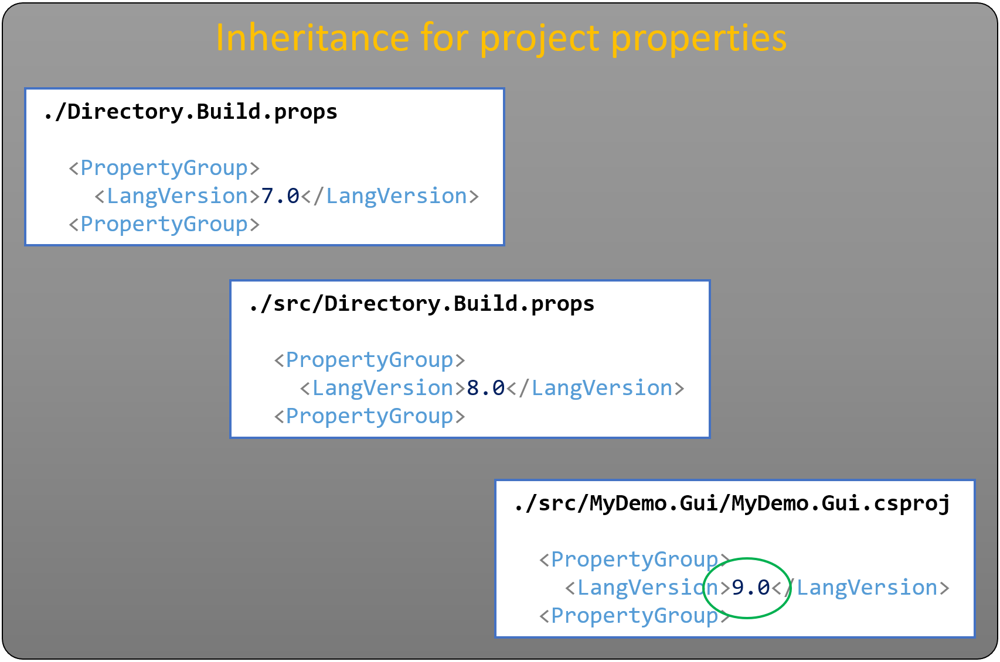
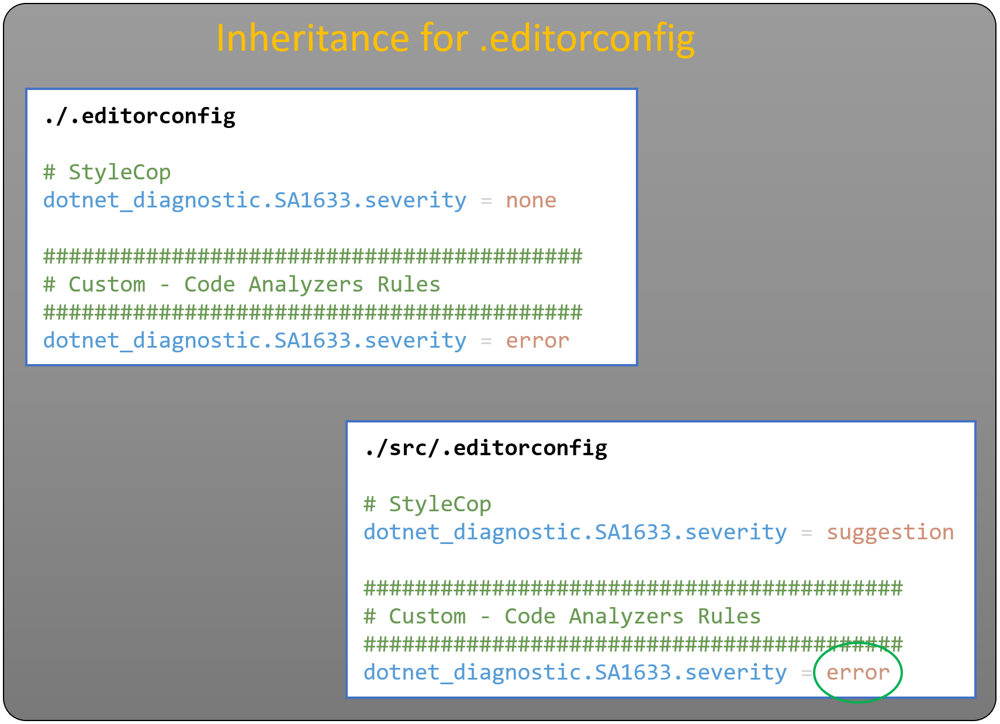

# 🧭 ATC-NET Coding Rules and Guidelines

A curated set of C# / .NET code analyzer rules maintained by the **ATC core team** — opinionated by design. 🛡️⚡

## 📚 Table of Contents

- [🎯 What is it?](#-what-is-it)
- [💡 Why use it?](#-why-use-it)
- [🔄 Process around changes](#-process-around-changes)
- [🚀 Usage](#-usage)
- [❓ Q & A](#-q--a)

## 🎯 What is it?

This repository contains the coding rules we use across all ATC projects. It is a collection of code analyzers where every rule is **`treated as an error`** by default for the **release build**. ❌🚫

When starting a new project, grab the [distribution](https://github.com/atc-net/atc-coding-rules/tree/main/distribution) folder — it is the fastest way to get a solution up and running with sane defaults. 📦

The primary target is **Visual Studio**, **Visual Studio Code**, and **.NET / C#**. 💙

## 💡 Why use it?

- ✅ One team — one shared set of rules across every project.
- ✨ Extensive C# code style settings that require the latest C# features.
- 📏 All .NET naming follows the official [Framework Design Guidelines — Naming Guidelines](https://docs.microsoft.com/en-us/dotnet/standard/design-guidelines/naming-guidelines).
- 🤝 Consistency saves reviews, onboarding time, and midnight arguments.

## 🔄 Process around changes

When a rule feels annoying and somebody wants to disable it, it must follow a standard procedure:

1. 📝 A clear argumentation for **why** the rule should be disabled.
2. 🧑‍🤝‍🧑 A session with the ATC core team to decide.
3. ✅ The decision is executed and documented in the PR that changes the rule.

> 🚨 **NO rules may be deactivated by a single person.** Every change must be reviewable so that anyone can later trace the decision.

## 🚀 Usage

Copy the [distribution](https://github.com/atc-net/atc-coding-rules/tree/main/distribution) folder into the root of your project. Once it is in place, opening a file in Visual Studio automatically picks up the `.editorconfig` — formatting is enforced and violations surface as warnings or errors. 🧪

For **Visual Studio Code**, install the [EditorConfig for VS Code](https://marketplace.visualstudio.com/items?itemName=EditorConfig.EditorConfig) extension to get the same experience. 🧩

## ❓ Q & A

### 🛫 Q: How do I get started?

- 🛠️ The fastest path: use the [atc-coding-rules-updater](https://github.com/atc-net/atc-coding-rules-updater/blob/main/sample/README.md) sample — it scaffolds everything for you.
- 📥 Or simply download the files from the `distribution` folder manually.

The first run of the updater will create the following folders and drop relevant files into each:

| Folder    | Purpose                                 |
|-----------|-----------------------------------------|
| `src`     | 🏗️ Source code                           |
| `test`    | 🧪 Test code                             |
| `sample`  | 🎨 Sample / demo applications            |

If `sample` is not relevant, just delete it — it will not be recreated on the next run. 🗑️

### 🔍 Q: I see a rule is suppressed — why?

1. 📌 **Inline suppression (`SuppressMessage` attribute):** the `Justification` field should explain it.
2. 🧾 **Suppressed in `.editorconfig`:** check the trailing comment on the same line, the git history (`git blame`), or the PR that introduced the change — that is where the decision lives.
3. 🚧 **Not documented anywhere?** Then the suppression is **INVALID**. Use `git blame`, follow up with the author, and tighten the PR-review process. 🛡️

### 💬 Q: I have a suggestion for a rule I don't like

You are welcome to challenge a rule! 🙌

Open a new [issue](https://github.com/atc-net/atc-coding-rules/issues/new/choose) using the **Rule suppression suggestion** template. The ATC core team will pick it up in the regular review cadence.

### 📄 Q: What is a .editorconfig file?

EditorConfig helps developers define and maintain consistent coding styles across editors and IDEs. It is a file format + a set of editor plugins that read the file and apply the rules. The files are plain text and play nicely with version control. 🌍

Learn more:
- 🌐 [editorconfig.org](http://editorconfig.org/)
- 🧰 [Visual Studio Docs — editor](https://docs.microsoft.com/en-us/visualstudio/ide/create-portable-custom-editor-options?view=vs-2019)
- 🎨 [Visual Studio Docs — code style](https://docs.microsoft.com/en-us/visualstudio/ide/editorconfig-code-style-settings-reference)

### ⚠️ Q: What severity levels are used?

The default severity for atc-coding-rules is:

```ini
dotnet_analyzer_diagnostic.severity = error
```

…and **`Treat Warnings As Errors`** is enabled for **`Build-Target = Release`**. 🚦

That means only the following severities are actually used:

- ❌ `error`
- 💡 `suggestion` (shows as `Info` in the [Visual Studio Error List](https://docs.microsoft.com/en-us/visualstudio/ide/reference/error-list-window?view=vs-2019))
- 🙈 `none`

Reference reading:
- 📘 [Configuration options → severity-level](https://docs.microsoft.com/da-dk/dotnet/fundamentals/code-analysis/configuration-options#severity-level)
- 📙 [Configure severity levels in Visual Studio](https://docs.microsoft.com/en-us/visualstudio/code-quality/use-roslyn-analyzers?view=vs-2019#configure-severity-levels)

### 🧬 Q: How does inheritance work for project properties?

Say you want to set the `LangVersion` property. You can set it in the `.csproj` file, in a `Directory.Build.props` file, or in both. `MSBuild` and `dotnet build` walk the hierarchy of `Directory.Build.props` and `.csproj` files to resolve the value. **Last definition wins.** 🏁

Example hierarchy:



The `LangVersion` property value will be read as: ~~7.0~~ → ~~8.0~~ → **9.0** ✅

### 🎚️ Q: How does inheritance work for the severity level of a rule?

Say you want to set the severity level for rule `SA1633`. You can set it in any `.editorconfig` file, and it can be set multiple times. Editors like **Visual Studio** and **VS Code** walk the `.editorconfig` hierarchy to resolve the **key/value** pair (`dotnet_diagnostic.SA1633.severity`). **The last definition wins.** 🏁

Example hierarchy:



The `dotnet_diagnostic.SA1633.severity` value will be read as: ~~none~~ → ~~error~~ → ~~suggestion~~ → **error** ✅

### 🧱 Q: Central vs. Custom section — who owns what?

Every `.editorconfig` in the `distribution` folder is split into two halves, separated by these banner comments:

```ini
##########################################
# Custom - File Extension Settings
##########################################

...

##########################################
# Custom - Code Analyzers Rules
##########################################
```

- 🏛️ **Everything ABOVE the `# Custom - ...` banners** is the **central baseline** — provided and maintained by the ATC core team in this GitHub repo. Think of it as a shared default, a starting point that keeps ATC projects aligned out of the box. 🌐
- 🧑‍💻 **Everything BELOW the `# Custom - ...` banners** belongs to the **local team** — the team that owns the repository where the file lives. This is where the team writes its own rules, tweaks, exceptions, and overrides. 🛠️

> 👑 **The local team always has the final word.** This repository only *suggests* a baseline. The team that owns the target repository decides what actually ships — they can suppress, relax, tighten, or replace any rule by adding an entry in their Custom section. No one outside that team can overrule them.

**Why the override always works** 🔧

EditorConfig reads top-to-bottom and *last definition wins*. Because the Custom section sits **after** the central section, any rule the local team puts there automatically trumps anything declared earlier — no special syntax, no opt-in, just ordering. That is also why the central section must stay above: it is a baseline, not a ceiling. 🏁

**Guidelines** 📋

- ✅ **Do** put project-specific suppressions, extra rules, severity changes, or temporary relaxations in the Custom section — and document *why* in a trailing comment so future-you (and future reviewers) can follow the reasoning. 📝
- ✅ **Do** treat the central section as read-only in consuming repositories — not because you can't edit it, but because the next sync from `distribution` will overwrite it and you will lose your change. 🔄
- 🚫 **Don't** feel pressured to accept every central rule as-is. If a rule hurts your team more than it helps, overriding it in the Custom section is a perfectly valid, first-class decision — that is exactly what the section is there for. 💪
